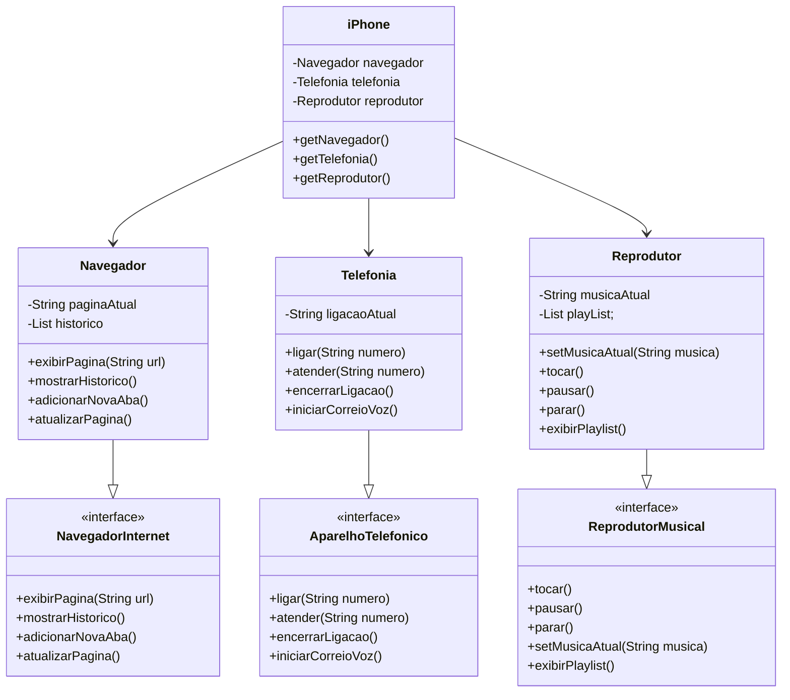

# Projeto iPhone Simulador

Este projeto é um exercício do bootcamp **Desenvolvimento Java com IA** da empresa **DIO**. Ele simula as funcionalidades básicas de um iPhone, incluindo navegação na internet, reprodução de músicas e funcionalidades telefônicas, utilizando Programação Orientada a Objetos (POO) e UML.

## Funcionalidades

### Diagrama UML


### Navegador

- **exibirPagina(String url)**: Navega para uma URL específica.
- **adicionarNovaAba()**: Adiciona uma nova aba no navegador.
- **atualizarPagina()**: Atualiza a página atual.
- **mostrarHistorico()**: Mostra o histórico de navegação.

### Reprodutor Musical

- **tocar()**: Toca a música atual.
- **pausar()**: Pausa a música atual.
- **parar()**: Para a música atual.
- **setMusicaAtual(String musica)**: Define a música atual e a adiciona à playlist.
- **exibirPlaylist()**: Exibe a playlist atual.

### Aparelho Telefônico

- **ligar(String numero)**: Faz uma chamada para o número especificado.
- **atender(String numero)**: Atende uma chamada recebida.
- **encerrarLigacao()**: Encerra a chamada atual.
- **iniciarCorreioVoz()**: Inicia o correio de voz.

## Como Executar

1. Clone o repositório:
```bash
git clone https://github.com/seu_usuario/seu_repositorio.git
```

2. Navegue até a pasta do projeto:
```bash
cd seu_repositorio/src/main/java/app
```

3. Compile e execute o projeto:
```bash
    javac App.java
    java App
```

## Tecnologias Utilizadas

    Java 11 ou superior
    IDE de sua preferência (Eclipse, IntelliJ, etc.)

## Contribuição

Sinta-se à vontade para contribuir com este projeto! Sugestões e melhorias são sempre bem-vindas.

## Licença

Este projeto está licenciado sob a MIT License. Veja o arquivo LICENSE para mais detalhes.